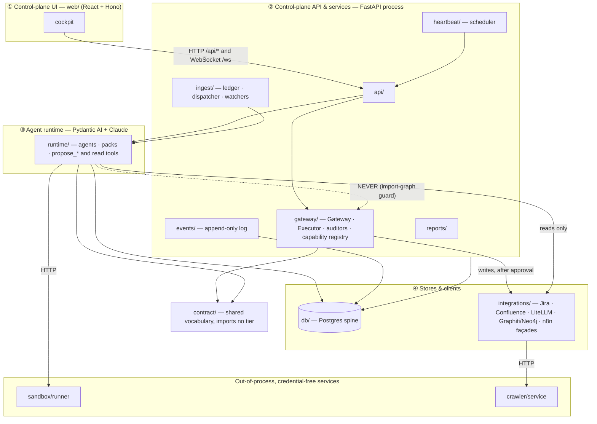
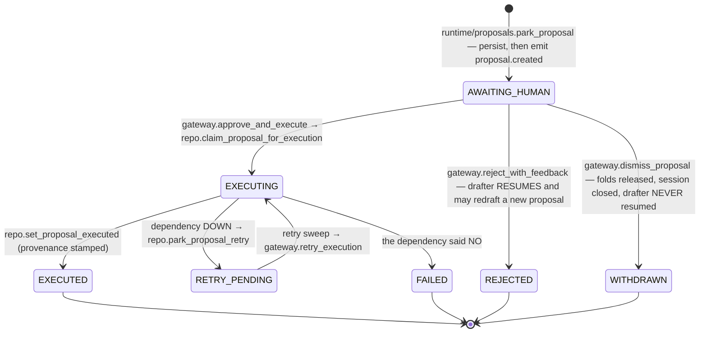

# Central Command — Architecture (the living map)

> **What this is.** The map of the system **as built**, verified against the
> code at v2.38.2 (2026-09-20). [`DESIGN.md`](DESIGN.md) is the *founding*
> design, frozen; where the two disagree, the code and this file win.
>
> **What this is not.** A rulebook. The operative rules are
> [`AGENTS.md`](../AGENTS.md) and the path-scoped files under
> [`.claude/rules/`](../.claude/rules/); the *why* behind each rule is indexed in
> [`decisions/`](decisions/README.md); what each design record became is in
> [`superpowers/README.md`](superpowers/README.md); unfinished work is in
> [`ROADMAP.md`](ROADMAP.md). This file links to those rather than restating them.
>
> **Keeping it true.** Every row below names a path. When you move or rename a
> seam, fix the row in the same change. Anything that could not be verified is
> marked *(unverified)* — never guessed.

## 1. The paradigm in one screen

A **modular monolith in four tiers** built around one idea: **agents propose,
a gate approves, a credentialed Executor performs.** The trust boundary is not
a network hop or a permission table — it is the **Python import graph**:
`central_command/runtime/` may never import `central_command/gateway/`
(guard: `tests/test_governance.py::test_runtime_never_imports_the_gateway_tier`,
an AST walk over every runtime module).

**What the runtime can reach.** `runtime/` does import `integrations/` clients,
and every call it makes against a credentialed system is a *read* (Jira,
Confluence, the git forge, Graphiti, LiteLLM `/model/info`, the mail façade's
`list_refs`/`get_message`, web fetch). The one mutating client it uses is
`integrations/sandbox_client.py`, against the sandbox — which holds no
credentials by design (containment, not restriction; see AGENTS.md). Every
write method on a credentialed client is called from `gateway/executor.py`
only. This read-only property is a guard test, not an inspection:
`tests/test_runtime_integration_reads.py` walks every module under `runtime/`,
resolves every name bound to an `integrations` submodule, and checks each
attribute reached through it against a frozen per-client allowlist of confirmed
reads — so a write that appears in the runtime tier fails the suite in the
commit that adds it (DL-103).

**Two intentional package cycles**, both broken with function-scoped imports
and neither crossing the forbidden edge: `api ⇄ gateway` (`api/routes.py`
imports the gateway at module level; `gateway/gateway.py` and
`gateway/executor.py` reach back into `api.orchestration` /
`api.routes.create_and_run_task` lazily) and `api ⇄ runtime` (`runtime/questions.py`
and `runtime/converse.py` lazily import resume callbacks from
`api/orchestration.py`). `contract/` imports nothing from `api`, `gateway` or
`runtime`; `sandbox/` and `crawler/` import nothing from `central_command` at all.

## 2. Package map

Every package under `central_command/`. "Creds" = whether code in the package
holds or uses external credentials.

| Package | Tier | Creds | What it is | Key seams | Rules |
|---|---|---|---|---|---|
| `api/` | ② | no | The FastAPI app: JSON API, SSE stream, the cockpit's WebSocket gateway, the orchestration driver, updates, systems launchpad, attachments, speech | `app.py` (assembly), `routes.py`, `nerve_gateway.py` (`/ws`), `orchestration.py`, `hold.py`, `update.py`, `systems.py`, `attachments.py` | [cockpit](../.claude/rules/cockpit.md), [runtime-resilience](../.claude/rules/runtime-resilience.md) |
| `gateway/` | ② | **yes** (via Executor) | The trust boundary: the one approval seam, the Executor, the capability registry (89 capabilities at v2.38.2), the dismissal auditor, the graph auditor, deterministic policy checks, agreement records, wiki-claims capture | `gateway.approve_and_execute`, `reject_with_feedback`, `dismiss_proposal`, `retry_execution`; `executor.execute`; `capabilities.REGISTRY`; `auditor.audit_dismissal` | [AGENTS.md](../AGENTS.md) |
| `runtime/` | ③ | no | Agent definitions, capability packs (the tool surface as data), the `propose_*` and read tools, model resolution, durable pause/resume, conversations, consults, reflection, roster and hiring, per-agent profiles | `proposals.park_proposal`, `models.resolve_model`, `packs.toolset_for`, `durable.proposal_from_call`, `run.run_task` / `run_coach`, `agent.build_agent_for` (resume only), `roster`, `hiring`, `resume_park` | [runtime-resilience](../.claude/rules/runtime-resilience.md), [models](../.claude/rules/models.md) |
| `contract/` | shared | no | The vocabulary both tiers speak: proposal models, status enums, `ARG_SPECS` argument shapes, `claim_supported`, the failure taxonomy (DOWN vs NO), one-click-unsubscribe eligibility | `args.ARG_SPECS` / `validate_action_args`, `models.claim_supported`, `failures.is_transient`, `mail.py` | [AGENTS.md](../AGENTS.md), [integrations](../.claude/rules/integrations.md) |
| `db/` | ④ | DSN | The Postgres spine: one asyncpg access layer and the schema | `repo.py` (the access layer — nearly all SQL; the exceptions are the advisory-lock leases in `heartbeat/engine.py` and `ingest/dispatcher.py`, and `integrations/litellm_credstore.py`, which talks to LiteLLM's own database), `schema.sql` (auto-loaded on a **fresh** database only) | [AGENTS.md](../AGENTS.md) |
| `events/` | ② | no | The append-only event log: write to Postgres, then fan out; WARNING+ log records bridged into events | `events.emit` (the only publish path), `log.py`, `bridge.py` | [AGENTS.md](../AGENTS.md) |
| `ingest/` | ② | no | The Work Ledger and everything that feeds it: live mail feed, backlog enrollment, the backpressure dispatcher, mail-body conversion, filesystem watcher, catalog enrollment, bulk dismissal, wiki freshness sweep | `dispatcher.process_claimed` (the one path every item takes), `ledger.enroll_*` / `hydrate_work_item`, `mailtext.py` (the one mail-body converter), `feed.poll_once` | [integrations](../.claude/rules/integrations.md), [`QUEUE.md`](QUEUE.md) |
| `heartbeat/` | ② | no | The scheduler for recurring team work: tick loop, action registry, dependency-health probes | `engine.fire` (one firing path for tick and run-now), `actions.py` (`ActionSpec`, 12 kinds), `probes.py` | [runtime-resilience](../.claude/rules/runtime-resilience.md) |
| `integrations/` | ④ | **yes** | Clients for external systems. **Native** clients: `jira.py`, `confluence.py`, `litellm.py`, `litellm_credstore.py`, `forge.py`, `neo4j_reader.py`, `neo4j_writer.py`. **Via MCP**: `graphiti.py`. **n8n façades** (n8n holds the mail/calendar OAuth): `email_facade.py`, `calendar_facade.py`, `n8n_facade.py` (Jira fallback). **Uncredentialed**: `webfetch.py`, `crawler.py`, `sandbox_client.py`. `http.py` is the pluggable-trust httpx factory (CA bundle / mTLS) | per-client modules | [integrations](../.claude/rules/integrations.md), [graph](../.claude/rules/graph.md), [models](../.claude/rules/models.md) |
| `reports/` | ② | no | Deterministic, judgment-free reads composed from the spine: the EA's snapshot, the operator's calendar day, the EA's open follow-ups | called only from `runtime/tools.py` and `heartbeat/actions.py` | — |
| `sandbox/` | out-of-process | **none, by design** | A standalone FastAPI service (`runner.py`) giving agents a disposable workspace. Two backends behind one API: `kubectl` (a gVisor Job+Pod per session) or `podman` (a container per session). Never imported; reached only through `integrations/sandbox_client.py`. Its single exit is the gated `mcp.sync_source`, content captured at propose time | `runner.py` | [AGENTS.md](../AGENTS.md) |
| `crawler/` | out-of-process | none | A standalone browser-rendering crawl service (`service.py`) for whole-site documentation import. Never imported; reached through `integrations/crawler.py`, whose only caller is `skills/site_import.py` | `service.py` | — |
| `skills/` | ②/③ | no | The skills library's import side: `SKILL.md` + references → DB rows and a chunked search index; whole-site import | `importer.py`, `site_import.py`, `ids.py` | — |
| `config.py` | all | reads `.env` | Every `CC_*` setting, with its comment as documentation | `settings` | — |

### The parts `DESIGN.md` does not describe

- **`api/orchestration.py` is a driver; `runtime/orchestrator.py` is an agent.**
  The agent (`runtime/orchestrator.py`) holds no `propose_*` tools — it
  recommends routing and changes nothing. The driver (`api/orchestration.py`,
  tier ②) runs multi-agent *projects* as a durable plan → assign → receive →
  decide loop: it parks on deferred tool batches, creates child tasks, and
  resumes after decisions (`run_project`, `maybe_resume`, `resume_sweep`,
  `resume_parked_session`, `resume_consult_wait`, `resume_task_wait`,
  `retry_parked_task`, `continue_session`). It is also where the retry sweep
  lives (`retry_sweep`), because that sweep must reach `gateway.retry_execution`.
- **`api/nerve_gateway.py`** answers the cockpit's gateway wire protocol
  (JSON-RPC over WebSocket at `/ws`). It is a read-and-plumbing surface; writes
  go through the same gateway functions the HTTP routes call.
- **`api/hold.py`** is the update hold: pause the team, wait for in-flight
  agent work to land, then trigger the updater.
- **`api/update.py`** serves the single-node profile's version check and
  upload/apply/status routes; the k3s profile's updater is driven from the
  cockpit server (`web/server/routes/cc-update.ts`) through systemd path units.
- **`gateway/capabilities.py`** is "executable truth": each `Capability` row
  carries `kind`, `gate`, `risk` (free text — what a wrong use costs),
  `holder`, `route` and `arguments`. Agent charters' capability sections are
  *generated* from pack grants over this registry at run start.

## 3. Lifecycles, as built

### Proposal

- **Before the gate.** A `propose_*` tool validates argument shape against
  `contract.ARG_SPECS` (a malformed draft goes back to the model as a
  `ModelRetry`, up to `max_retries=10`), then the run pauses at a deferred call
  and `park_proposal` is the one path into the queue.
- **At the gate.** `proposal.decided` is emitted inside
  `approve_and_execute` *before* `executor.execute()` runs. The Executor
  re-runs the same shape validation over every action before the first one
  runs, then world-state checks, then the handlers; `proposer` comes from the
  gateway, never from the agent's arguments.
- **Operator routes.** `POST /proposals/{id}/approve | reject | dismiss`
  (`api/routes.py`); the cockpit reaches the same gateway functions over `/ws`.
- **Folds.** Sibling work items folded into a proposal sit in `FOLD_PENDING`;
  they go terminal (`FOLDED`) only when the covering proposal executes
  (`repo.commit_folds`) and return to `UNPROCESSED` on reject, dismiss or failure.
- **Founding states that were never built.** `DESIGN.md` §2 lists DRAFT,
  UNDER_AUDIT, AUTO_APPROVED, STALE and EXPIRED; none exists in code.
  `ProposalStatus.proposed` is only the in-memory default of a proposal
  record before it is parked — it is never persisted (rows begin at
  `AWAITING_HUMAN`); `ProposalStatus.approved` is declared and tolerated in a
  few `status in (...)` reads but never assigned.

### Who may approve what

Every world-change passes **one seam** (`gateway.approve_and_execute`). What
varies is the approver.

| Category | Approver | Classes today | Switch (default) |
|---|---|---|---|
| **Human gate** — the baseline for everything | the operator | every capability whose `gate` is human approval: Jira, Confluence, calendar, mail, graph episodes and curation proposals, charter edits, MCP sync, model configuration, … | — |
| **Graduated class** — the independent auditor re-derives the judgment from the raw source; a **CONCUR** executes with `approver="auditor"`, a **CHALLENGE** or an auditor error parks for the operator | the auditor, per class, revocable | `dismissal.confirm` (email dismissals) and `work.bulk_dismiss`; `dismissal.confirm.document`; graph-verification rows that are aligned, mechanically clean and addition-only (invalidations always park) | `CC_AUDITOR_ENABLED` (false) + `CC_AUDITOR_MODE` (shadow); `CC_AUDITOR_DOCUMENT_MODE` (shadow); `CC_GRAPH_AUDITOR_ENABLED` (false) + `CC_GRAPH_AUDITOR_MODE` (shadow) |
| **Ungated deterministic write** — no proposal, because there is no agent judgment to review | code, or the operator's own click | graph curation: a closed write set in `integrations/neo4j_writer.py` called by the API tier for the operator's own edits; wiki stale-page annotation: a deterministic template over claim rows, no model in the path | — ; `CC_WIKI_ANNOTATION_MODE` (off) |

Graduation is **configuration, never code**, one class at a time, on recorded
agreement evidence (`gateway/auditor.py`, `gateway/steward_agreement.py`,
`gateway/graph_auditor.py`); a fresh install is fully human-gated. Doctrine:
[trust-tier graduation](superpowers/specs/2026-07-30-trust-tier-graduation-design.md);
decisions: [`decisions/trust-gate.md`](decisions/trust-gate.md).

### Session

`session.status` is free text in `schema.sql` on purpose (a new wait state needs
awareness in its readers, never a migration). The values in use:

```mermaid
stateDiagram-v2
    [*] --> RUNNING
    RUNNING --> AWAITING_HUMAN: a propose_* call deferred
    AWAITING_HUMAN --> RUNNING: verdict recorded → resume
    RUNNING --> AWAITING_OPERATOR: conversation between turns
    AWAITING_OPERATOR --> RUNNING: operator message
    AWAITING_OPERATOR --> DONE: conversation ended (status flip; transcript kept)
    RUNNING --> AWAITING_AGENTS: waiting on child tasks or a consult
    AWAITING_AGENTS --> RUNNING: children landed
    RUNNING --> AWAITING_RESUME: resume leg failed transiently (resume_park)
    AWAITING_RESUME --> RUNNING: retry sweep, health-gated
    RUNNING --> AWAITING_CONTINUE: request window spent — never auto-driven
    RUNNING --> STOPPED: operator stop — never auto-driven
    AWAITING_CONTINUE --> RUNNING: operator continues
    STOPPED --> RUNNING: operator resumes
    RUNNING --> DONE
    RUNNING --> FAILED: always with a recorded reason
    DONE --> [*]
    FAILED --> [*]
```

`contract/enums.py::SessionStatus` is a narrower, older list (it still names
`AWAITING_INPUT` and `ABORTED`, which nothing sets); the schema comment is the
authority. Sessions are never deleted, and one agent may hold several at once.

### Task and work item

| Entity | States | Where |
|---|---|---|
| Task | `NEW → ASSIGNED → IN_PROGRESS → REVIEW → DONE \| FAILED \| CANCELLED` (the founding design's `BLOCKED` was never built) | `db/schema.sql` (task table), `db/repo.py` |
| Work item (ledger) | `UNPROCESSED → CLAIMED → (FOLD_PENDING \| DISMISS_PENDING) → PROCESSED \| FOLDED \| FAILED` | `db/schema.sql` (work_item), `ingest/dispatcher.py` |

## 4. Spine mechanics

- **Event log.** `events.emit()` writes the row to Postgres, then fans out to
  in-process subscribers; the SSE stream (`GET` stream route in
  `api/routes.py`) and the cockpit's `/ws` push frames are projections of the
  table, never a parallel channel. Roughly 140 distinct event types are emitted
  today. Ordering rule: an event that *authorises* something is written before
  the thing it authorises.
- **Heartbeat.** Schedules are governed rows (`cron` | `every` | `at`), one
  heartbeat per database via an advisory lock, missed fires skipped rather than
  replayed. Twelve action kinds: `feed.poll`, `dispatch.window`, `source.walk`,
  `wiki.freshness`, `task.create`, `report.audit_agreement`,
  `discussion.sweep`, `retry.sweep`, `graph.verify_sweep`,
  `sandbox.run_script`, `ea.contact`, `litellm.discovery`. An action never
  awaits agent work; an action may be "quiet" (writes nothing when immaterial)
  only via the `ActionSpec.material` allowlist.
- **Ingest.** Feed or watcher → `ledger.enroll_*` (`UNPROCESSED`) →
  dispatcher claim → `dispatcher.process_claimed()` → agent run → terminal
  state. Valves: concurrency, the approval-coupled throttle (don't outrun
  review), token budget, max attempts. Dispatch is opt-in. Operations and
  defaults: [`QUEUE.md`](QUEUE.md).
- **Outage equivalence.** A dependency that is DOWN costs latency, never work:
  `contract/failures.py` classifies, sessions park `AWAITING_RESUME`,
  proposals park `RETRY_PENDING`, tasks retry-park, and the health-gated
  `retry.sweep` converges all three
  ([spec](superpowers/specs/2026-07-31-outage-equivalence-design.md)).
- **Models.** Everything addresses a `cc-*` role alias through the LiteLLM
  proxy; `runtime/models.resolve_model()` is the one seam (and where
  `CC_DEMO_MODE` swaps in the deterministic model). See
  [models rules](../.claude/rules/models.md).
- **Knowledge graph.** Agents read Graphiti over MCP and write only by gated
  `graph.add_episode` proposals into scoped partitions; the cockpit's Graph
  panel reads Neo4j directly over bolt. See [graph rules](../.claude/rules/graph.md).

## 5. The cockpit (`web/`)

A vendored fork of openclaw-nerve (React client, Hono server); provenance and
the quarantine list are in [`web/VENDORED.md`](../web/VENDORED.md).

- **Ours:** `web/server/routes/cc-*.ts`, and the Central Command screens under
  `web/src/features/` (VENDORED.md names them). **Ignore:**
  `web/vendor-unused/`, `web/docs/`, `web/.github/`. `web/server/app.ts` is the
  authority on which routes are live.
- **Two channels to the API.** (1) Every `cc-*` route is a thin HTTP proxy:
  `fetch(config.gatewayUrl + "/api" + path)`. (2) Chat, sessions and all live
  push ride a WebSocket: the browser connects to the cockpit server's `/ws`
  (`web/server/lib/ws-proxy.ts`), which relays to the `/ws` that **FastAPI
  serves** (`api/nerve_gateway.py`) by answering the wire protocol the upstream client
  already speaks. The Hono server's own SSE endpoint carries only local
  file-watcher events; `web/server/lib/gateway-rpc.ts` is upstream's
  workspace-file fallback client, not part of this seam.
- **Defaults.** Cockpit server on 3080 (`web/server/lib/constants.ts`); API on
  8080. The vendored default gateway URL does **not** point at the API —
  `GATEWAY_URL` in `web/.env` must, or every `cc-*` route returns 502.
- **Build.** `npm run build` → client bundle plus `web/server-dist/`
  (`tsc` never deletes removed sources from `server-dist` — see
  [cockpit rules](../.claude/rules/cockpit.md)); tests: `npm test` (vitest).

| Cockpit route | Proxies to (FastAPI) |
|---|---|
| `cc-kanban` | tasks (`/api/kanban/*`) |
| `cc-crons` | heartbeat schedules (`/api/crons*`) |
| `cc-memories` | graph episodes |
| `cc-tokens` | usage |
| `cc-activity` | activity overview, sessions, events, work-item requeue |
| `cc-charter` | agent charters |
| `cc-graph` | graph search / neighbourhood / provenance / status |
| `cc-loe` | level-of-effort |
| `cc-skills` | skills import (doc, file, site) |
| `cc-decisions` | bulk dismissal preview and submit |
| `cc-sources` | sources and the catalog |
| `cc-systems` | systems launchpad, API docs |
| `cc-update`, `cc-update-proxy` | update status / stage / apply / hold |
| `cc-context` | context-window settings |

## 6. Deploy surfaces

| Surface | What it is | Entry points | Read first |
|---|---|---|---|
| `deploy/single/` | Single-node profile on Compose (`compose.yaml`: postgres, litellm + its db and redis, graphiti, crawler, speech; n8n behind a profile). Deterministic driver, ten phases: validate · preflight · fetch · llm · stack · app · verify · test · boot · demo; exit codes 0/1/2/3 (3 = stopped for the operator) | `setup.sh`, `update.sh` (`init` · `import` · `stage` · `plan` · `apply` · `rollback`), `resolve-images.sh` + `images.txt` (constraint / locked tag / locked digest) | [`deploy/single/README.md`](../deploy/single/README.md), [deploy-single rules](../.claude/rules/deploy-single.md) |
| `deploy/k3s/` | Multi-node profile: numbered manifests (`00-namespace` … `90-speech`), placement split by state (stateful pinned, stateless floats), services exposed on loopback, the API / cockpit / sandbox-runner as systemd units outside the cluster. Same driver contract, six phases: validate · preflight · llm · stack · app · verify | `setup.sh`, `verify.sh`, `cc-update.sh`, `backup.sh`, `make-secrets.sh`, `mint-keys.sh`, `build-*-image.sh` | [`deploy/k3s/README.md`](../deploy/k3s/README.md), [deploy-k3s rules](../.claude/rules/deploy-k3s.md) |
| `deploy/pi/` | **Part live, part retired — never delete it as a whole.** Live: the `.env` the k3s scripts source (it holds the two encryption keys that must never change), the LiteLLM config and routing policy (`litellm/`), the Graphiti image build context (`graphiti/`), and the cockpit's systemd unit. Retired: the pre-k3s Compose stack and its units and scripts. `gateway/executor.py` and `runtime/tools.py` also name the `litellm/` files by path | — | [`deploy/pi/README.md`](../deploy/pi/README.md) (the authoritative live/retired table) |
| `deploy/n8n/` | The mail and calendar façade workflows as code; applied by both updaters | `apply-workflows.sh` | [`deploy/n8n/README.md`](../deploy/n8n/README.md) |
| `deploy/discover.sh`, `deploy/AIRGAP.md` | Environment discovery and the mirror / CA / proxy seams for restricted networks. Registry mirrors are per-upstream: `CC_REGISTRY_DOCKERIO`, `CC_REGISTRY_GHCR`, `CC_REGISTRY_MCR` | `discover.sh` | [`deploy/AIRGAP.md`](../deploy/AIRGAP.md) — **first**, for any mirrored or no-egress install |
| `deploy/desktop-superseded/` | History only; nothing references it | — | — |
| `docker-compose.yml` (root) | The dev database only: `cc-postgres` on 127.0.0.1:**5442** with the schema auto-loaded | `docker compose up -d postgres` | [AGENTS.md](../AGENTS.md) |

**The k3s updater** (`cc-update.sh`), in order: resolve → busy check →
rollback checkpoint → prebuild changed images (services stay up) → database
dumps → stop → merge → additive schema → rebuild venv and cockpit → manifests
and units → n8n workflows → restart → health → roll back on failure. It reads
`VERSION` for the installed version, not git. `kubectl apply` never deletes, so a
removed manifest must be tombstoned in `deploy/k3s/removed.txt`; a changed
updater unit takes effect on the *next* run.

Other top-level directories: `scripts/` (pre-push guard, vendored-docs and
model-library fetchers, `graph_inspect.py`, the M2 spike and M5 live acceptance,
evals runner, `oneoff/`), `skills/` (the shipped skill packs), `servers/` (MCP
servers — arrive only through an approved `mcp.sync_source`), `evals/`,
`fixtures/`, `docs/vendor/` (fetched, never hand-edited).

## 7. Id index — what M- and D-numbers mean

Code comments cite these; this is where they resolve.

### Milestones (the founding build order)

| Id | Meaning | Lives in |
|---|---|---|
| M0 | Scaffolding: package, schema, contract models, API health check | `central_command/`, `db/schema.sql` |
| M1 | The Proposal/Action contract round-trips cleanly | `contract/`, `tests/test_contract.py` |
| M2 | Durable pause: a deferred proposal survives a full process restart (deferred tool call + persisted message history — not DBOS) | `runtime/durable.py`, `scripts/m2_spike.py` |
| M3 | The Executor: first real write against a reversible target | `gateway/executor.py` |
| M4 | The control-plane API and dashboard | `api/routes.py` |
| M5 | Live end-to-end acceptance (real model, real write; spends money) | `scripts/m5_acceptance.py` |
| M6 | The Work Ledger | `ingest/ledger.py`, `db/schema.sql` |
| M7 | The backpressure dispatcher | `ingest/dispatcher.py` |
| M8 | The event log | `events/log.py` |
| M9 | Run context (`deps`) and the thread-lock/fold gap closed | `runtime/deps.py` |
| M10 | The knowledge-graph write path | `integrations/graphiti.py`, `tests/test_graph.py` |
| M11 | Coaching without deploys: governed charter versions; skills as rows | `runtime/skills.py`, `db/schema.sql` |
| M12 | The live email feed | `ingest/feed.py` |
| M13 | Backlog sweep: refs-only enrollment, content at claim time | `ingest/ledger.py` |
| M14 | Dismissal review | `tests/test_dismissal.py` |
| M15 | Sessions are never destroyed | `runtime/converse.py`, `db/repo.py` |
| M16 | The capability registry and packs that cannot drift from it | `gateway/capabilities.py`, `tests/test_packs.py` |

### Founding decisions (`DESIGN.md` D1–D22, extended in code to D27)

| Id | Meaning | Status |
|---|---|---|
| D1 | Employment models: EA / standing-guidance / direct-tasked | standing |
| D5 | The coaching loop: charter edits are proposed and gated | standing, built (stage 5a) |
| D7 | Orchestration is a role, not the EA | standing, built; auto-assign not graduated |
| D8 | The independent auditor | standing, built |
| D9 | Jira and Confluence stay the systems of record | standing |
| D11 → D11-r1 | No ungoverned private agent memory; revised 2026-08-01 to allow a *gated* per-agent graph partition | revised |
| D12 | Auditor rollout: shadow first, graduate per action class | standing, built |
| D13 | Mail bodies referenced and re-fetched, never stored | **reversed** — converted once and persisted ([decision log](decisions/ingest-integrations.md)) |
| D15–D16 | Dispatcher valves | standing, built |
| D17 | Thread-aware batching and folds | standing, built |
| D18 | Agent-version lifecycle and replay | deferred, not built |
| D19–D21 | Sandboxing / egress allowlists / vault / anomaly detection cut from the MVP | cut — though an agent sandbox was later built as *containment* |
| D22 | Runtime = Pydantic AI + Claude (+ DBOS) | standing; DBOS never adopted (the M2 finding) |
| D23 | Native client unless n8n already solved the integration | standing |
| D24 | The roster is data (`agent` rows; hire/retire are operator actions) | standing |
| D25 | The tool surface and charter capability list are generated from pack grants | standing |
| D26 | `packs.toolset_for()` is the one tool-surface assembly seam | standing (cited once) |
| D27 | The heartbeat scheduler | standing |

D2–D4, D6, D10 and D14 were entries in the founding *open-decisions register*
rather than architecture decisions, which is why no code cites a definition:
D2 the starting agent roster · D3 v1 scope = the walking skeleton (done,
Phase 1) · D4 how proactive the EA is on day one · D6 next-step fidelity ·
D10 heartbeat cadence and EA scope (now schedule rows, D27) · D14 the
document-retrieval vector store choice. D19–D21 were recorded there as
*process isolation + credential split*, *no egress policy* and *reuse the
integration tool's credential isolation*.

### Local namespaces — same numbers, different meanings

| Where you see it | It means | Owner |
|---|---|---|
| "D1"–"D5" in `deploy/single/` and deploy docs | Compose substrate / version pins / update pipeline / Helm / Zarf-not-adopted | [deploy-refactor spec](superpowers/specs/2026-09-03-deploy-refactor-design.md) |
| "Decision 9" in `gateway/wiki_claims.py`, `ingest/wiki_freshness.py`, `schema.sql` | Wiki claims: the wiki forgets deterministically | [sources-catalog spec](superpowers/specs/2026-08-23-sources-catalog-design.md) |
| "Decision 1–6", "Decision 1–5" | Local to the [expert-team-scaling](superpowers/specs/2026-08-22-expert-team-scaling-design.md) and [teaming doctrine](superpowers/specs/2026-07-29-teaming-consultation-doctrine-design.md) specs; not cited elsewhere | those specs |
| "D9 / Story 2.1 / AR-9" in `deploy/pi/graphiti/` | A pre-public numbering for the Graphiti LLM-client choice — **not** founding D9 *(origin lost: no surviving document defines that Story/AR scheme)* | — |
| `D-sandbox`, `D-web-read`, `D-confluence`, `D-graph-inspect` | Named, unnumbered decisions; each resolves to the design record of the same topic | [`superpowers/README.md`](superpowers/README.md) |
| "D1–D12" with 2026-09-19/20 dates | The 2026-09 consistency audit's operator decisions; the durable ones are in the [decision log](decisions/README.md) | — |

New work should cite a decision-log id (`DL-nnn`) or a record path, not mint
another D-number.

## 8. Where to go next

| You want | Read |
|---|---|
| The rules you must not break | [`AGENTS.md`](../AGENTS.md), then the [`.claude/rules/`](../.claude/rules/) file for the area |
| Why a rule exists, and what guards it | [`decisions/README.md`](decisions/README.md) |
| What a design record became | [`superpowers/README.md`](superpowers/README.md) |
| What is unfinished | [`ROADMAP.md`](ROADMAP.md) |
| Queue operations | [`QUEUE.md`](QUEUE.md) |
| What changed, release by release | [`CHANGELOG.md`](../CHANGELOG.md) |
| The founding intent | [`DESIGN.md`](DESIGN.md) |
