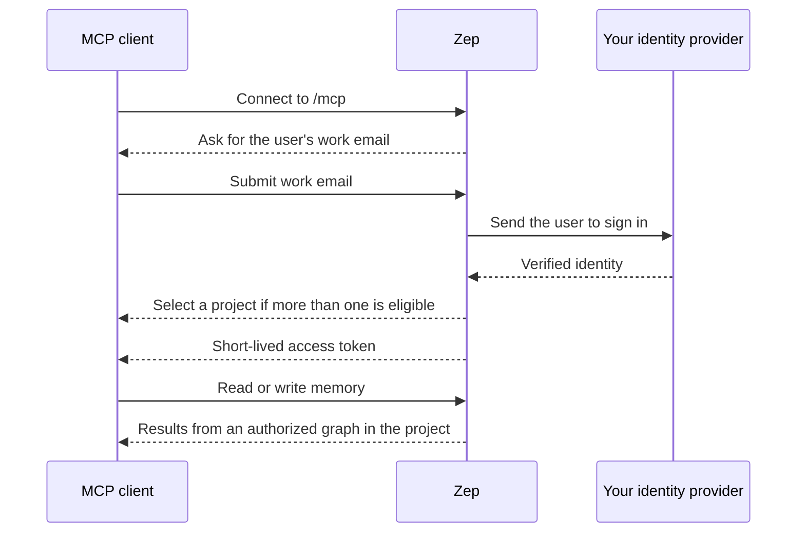

> For clean Markdown of any page, append .md to the page URL.
> For a complete documentation index, see https://help.getzep.com/llms.txt.
> For AI client integration (Claude Code, Cursor, etc.), connect to the MCP server at https://help.getzep.com/_mcp/server.

# Memory MCP Server

Uses per-account **MCP seats**; seat counts vary by plan. Custom OIDC requires the [Enterprise plan](https://www.getzep.com/pricing).

## Endpoint URL

```
https://api.getzep.com/mcp
```

One URL serves every MCP client and every Zep project on Zep managed cloud. BYOC deployments use the same `/mcp` path on their own API host. The [client setup steps](/memory-mcp-server/connect) show how to add the server to Claude, ChatGPT, Claude Code, Codex, Cursor, and other clients.

## What it does

The Memory MCP Server lets an end user connect an [MCP](https://modelcontextprotocol.io) client (Claude, ChatGPT, Claude Code, Codex, Cursor, and others) to their own agent memory in Zep. The user signs in through Google Workspace or your enterprise identity provider. The client then searches their memory for context and, when you allow it, adds new memory.

Not the [Documentation MCP server](/docs-mcp-server), which serves Zep's public docs to coding assistants. This server serves one end user's own memory, gated by your IdP.

The principal is the Zep **user**, the person whose memory lives in a project graph. The principal is not a member of your Zep account. Authentication runs inside your Zep deployment, on Zep managed cloud or BYOC. Your identity provider is the only external dependency, and it only handles login.

## Who it's for

Until now, only the agents your organization built on Zep's API could reach a user's memory. The Memory MCP Server opens that memory to the off-the-shelf agents your people already use.

Both work against the same memory. A user's in-house agent and their personal MCP client share one user graph, so context written by one is available to the other. Each user signs in through your single sign-on and writes only when you allow it.

Two roles appear throughout this documentation:

* **Administrators** — privileged members of your Zep account who configure the identity-provider connection for a project. See [Configuring authentication](/memory-mcp-server/authentication).
* **End users** — the people who connect an MCP client to their own memory. For Claude, Claude Cowork, ChatGPT, Claude Code, Codex, and Cursor, use the [Zep Memory plugin](/use-zep-in-claude-chatgpt) (skill plus MCP); members then sign in with their work identity. For other MCP clients, see [Connecting a client](/memory-mcp-server/connect).

## What users can access

Each connected user can always read their own user graph. User-graph tools take no user, graph, or project argument. The target is fixed by the authenticated identity, so one user's token cannot select another user's memory or another project.

When standalone graph access is allowed on the project connection, separate tools let the user list and select
standalone graphs in the same project. Connections can use project-wide access
or [UserGroup ABAC](/memory-mcp-server/standalone-graph-authorization) to grant
specific graphs to each user. Plans without ABAC retain project-wide access.

The server exposes these tools:

| Tool                    | Access | Purpose                                                                                                                                                                                                                                                                                                                                                     |
| ----------------------- | ------ | ----------------------------------------------------------------------------------------------------------------------------------------------------------------------------------------------------------------------------------------------------------------------------------------------------------------------------------------------------------- |
| `search_graph`          | read   | Search the user's memory for context relevant to a query. `scope`: `auto` (default, optimized context block), `observations` (durable patterns such as preferences), `thread_summaries` (per-conversation summaries), `episodes` (raw ingested messages/text/JSON), `nodes` (entities, each with its UUID and summary), or `edges` (facts between entities) |
| `get_user_summary`      | read   | Read the user's narrative summary                                                                                                                                                                                                                                                                                                                           |
| `get_subgraph`          | read   | Explore a bounded, multi-hop neighborhood around seed entity UUIDs                                                                                                                                                                                                                                                                                          |
| `get_node_neighbors`    | read   | List the entities directly connected to one entity, with the connecting facts                                                                                                                                                                                                                                                                               |
| `list_episodes`         | read   | List the user's raw ingested episodes, most recent first, optionally filtered to episodes that mention specific entities                                                                                                                                                                                                                                    |
| `add_memory`            | write  | Add new information to the user's memory as text, JSON, or a message                                                                                                                                                                                                                                                                                        |
| `list_graphs`           | read   | List other accessible graphs in the project ([graph directory](/graph-directory))                                                                                                                                                                                                                                                                           |
| `search_graph_in`       | read   | Search a selected standalone graph by `graph_id`; same `scope` options as `search_graph`                                                                                                                                                                                                                                                                    |
| `get_subgraph_in`       | read   | Explore a bounded, multi-hop neighborhood in a selected standalone graph by `graph_id`                                                                                                                                                                                                                                                                      |
| `get_node_neighbors_in` | read   | List an entity's direct neighbors in a selected standalone graph by `graph_id`                                                                                                                                                                                                                                                                              |
| `list_episodes_in`      | read   | List a selected standalone graph's raw ingested episodes by `graph_id`                                                                                                                                                                                                                                                                                      |
| `add_memory_to_graph`   | write  | Add information to a selected standalone graph by `graph_id`                                                                                                                                                                                                                                                                                                |

The navigation tools walk the graph by connection rather than by relevance.
Search first to find the entity UUIDs you need: `search_graph` with `scope=nodes`
returns the UUIDs that seed `get_subgraph` and anchor `get_node_neighbors`. The
tools return the same [neighbors, subgraph, and episode data](/reading-data-from-the-graph#navigating-the-graph)
as the graph API, so search remains the cheapest path for most questions and
traversal is for questions about how entities relate. `get_subgraph`,
`get_node_neighbors`, and `list_episodes` operate on the user's own graph; the
`_in` variants apply the same behavior to a selected standalone graph.

When standalone graph access is enabled, the server also exposes the paginated
`zep://graphs/directory` resource. It returns each accessible graph's
`graph_id`, name, and description so an agent can select a graph before calling
`search_graph_in`. See [Graph directory](/graph-directory) for the shared
API/SDK and MCP contract.

Write tools are offered when writes are enabled on the connection. A connection allows writes by default; an administrator can switch it to read-only, and an account-level kill switch can disable all writes regardless of per-connection settings. See [Configuring authentication](/memory-mcp-server/authentication#writes).

## How it works

Two separate questions decide every request: who the user is, and what they can reach.

* **Who the user is.** The end user signs in through your identity provider. Zep brokers that sign-in: the MCP client authenticates against Zep, and Zep sends the user to your IdP to log in. Zep then issues the client a short-lived token for that user.
* **What the user can reach.** Zep uses the user's work email to discover the organization's identity provider. After authentication, Zep finds every enabled project connection that admits the verified identity. It selects the project automatically when there is one, shows a chooser when there is more than one, and denies access when there are none. Zep binds the issued token to the selected connection and project. Each user reaches their own user graph, with read or write access set by the connection. If standalone access is enabled, project-wide mode makes every standalone graph available; UserGroup ABAC mode limits the directory and selected-graph tools to explicit grants. The project cannot be selected by an MCP request or tool argument.

Because Zep brokers the connection, your identity provider only handles login. The MCP client never registers with your IdP and never receives a token from it. You do not pre-register each client (Claude, ChatGPT, Claude Code, Codex, Cursor) in your IdP. Google Workspace is the default setup on Zep managed cloud; Custom OIDC on Enterprise covers Entra ID, Okta, and other OIDC providers, and is the only option in BYOC.



The client uses one MCP endpoint URL for every project. The browser flow discovers the identity provider from the user's work email and offers a project choice only when the verified identity can access more than one. The client discovers the rest of the authentication flow and registers itself automatically over standard OAuth 2.1 with PKCE.

### Mapping identities to users

Zep maps a claim from your identity provider to a Zep user, so a returning person reaches the same memory each time. The claim is `sub` by default, or the Google subject for Workspace. When you enable just-in-time provisioning, a new user is created on first sign-in with given and family name from the IdP when those claims are present; otherwise only existing Zep users can connect. If you later delete that Zep user, MCP recreates them on the next sign-in or request once the deletion finishes (same user ID, new graph). See [Configuring authentication](/memory-mcp-server/authentication).

### Sessions

Access tokens are short-lived, about five minutes by default. The client renews them automatically while the grant remains within the connection's grant maximum lifetime. An administrator can disable the connection at any time. See [Revoking access](/memory-mcp-server/authentication#revoking-access).